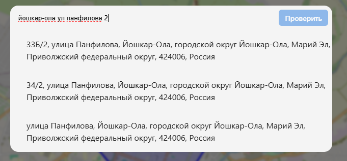
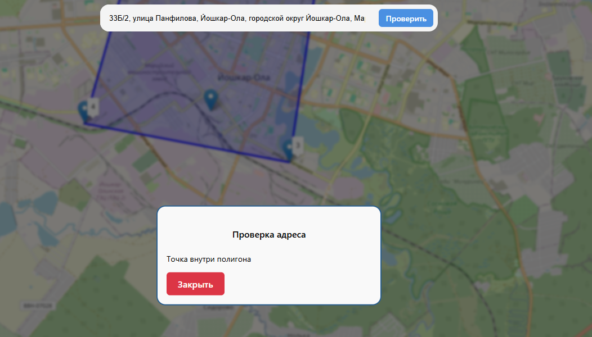
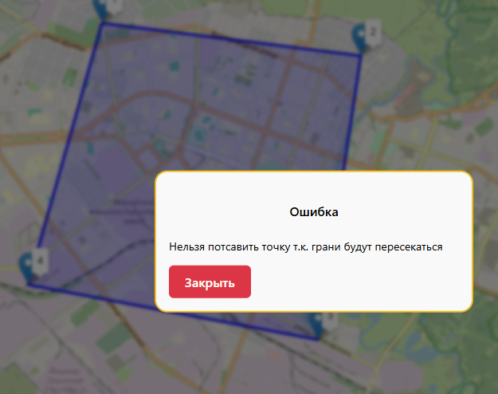
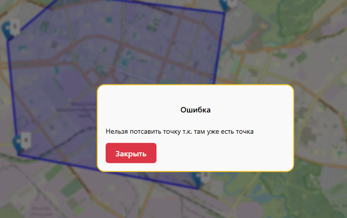
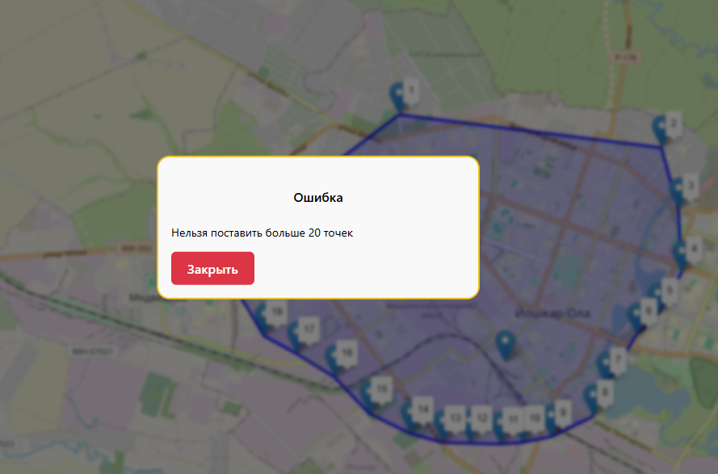

# Location in area checker - проверяет находится ли адрес внутри полигона

## 🌟 Возможности

- Создать полигон
- Редактировать полигон (перемещение вершин)
- Удаление полигона
- Проверить адрес на нахождение внутри полигона
- Подсказки при вводе адреса

## 🛠 Инструкция

- Чтобы создать полигон, надо нажать на карту, добавится точка на карте
- Полигон содержит от 3 до 20 вершин
- Чтобы поставить точку адреса на карту, надо ввести адрес и выбрать элемент из списка
- Нажать на кнопку "проверить"
- Чтобы удалить полигон можно нажать "Удалить полигон"
- Чтобы переместить точку адреса можно ввести другой адрес и выбрать из списка

## 🚀 Запуск проекта

1. 
```bash
   git clone https://github.com/mandms/location-in-area-checker.git
   cd location-in-area-checker
   ```
2.
```bash
   npm install
   ```
3.
```bash
   npm run dev
```

1. Поле ввода адреса
    
2. Проверка адрес в полигоне или нет
    
3. Ошибка при пересечения граней (когда ставим новую точку или перемещаем существующую)
    
4. Ошибка когда ставим точку на точку
    
5. Ошибка нельзя добавить больше 20 точек
    